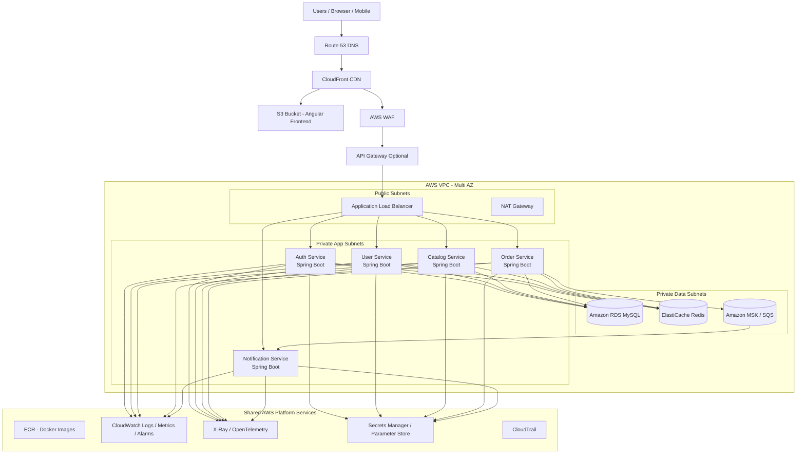
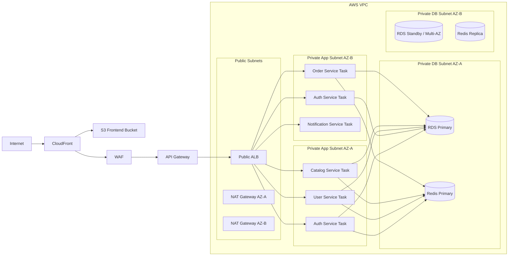
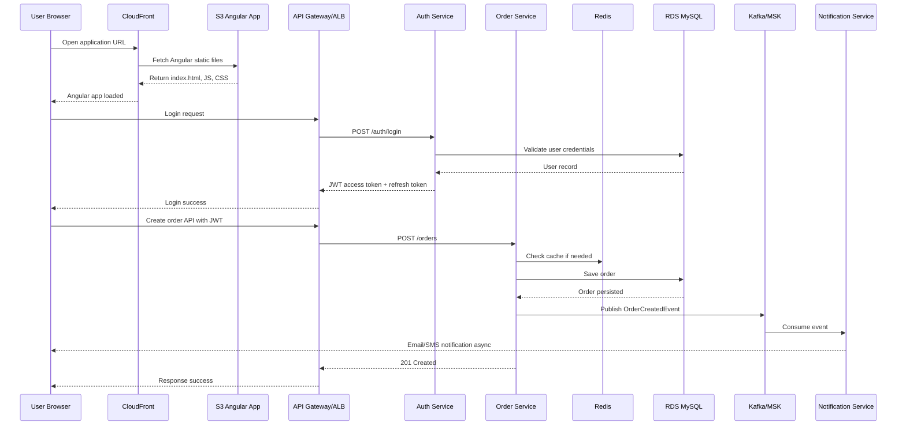
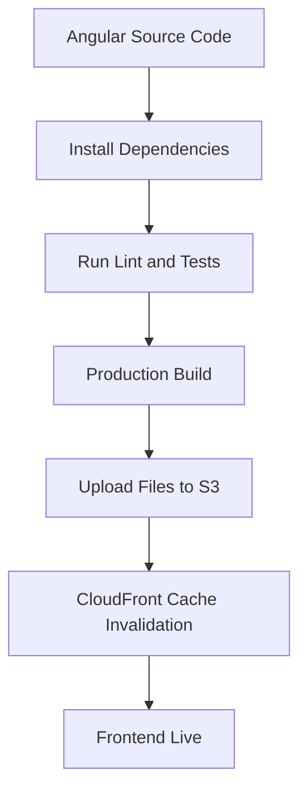
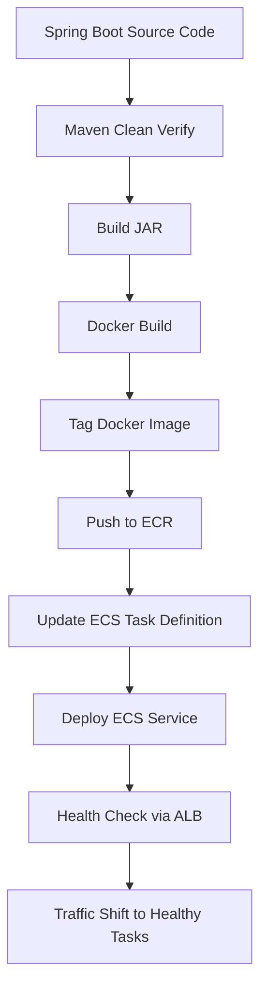
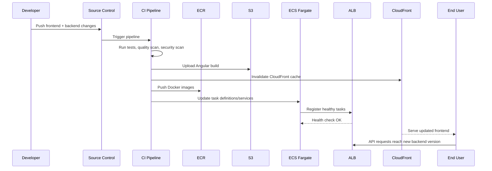
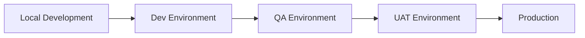
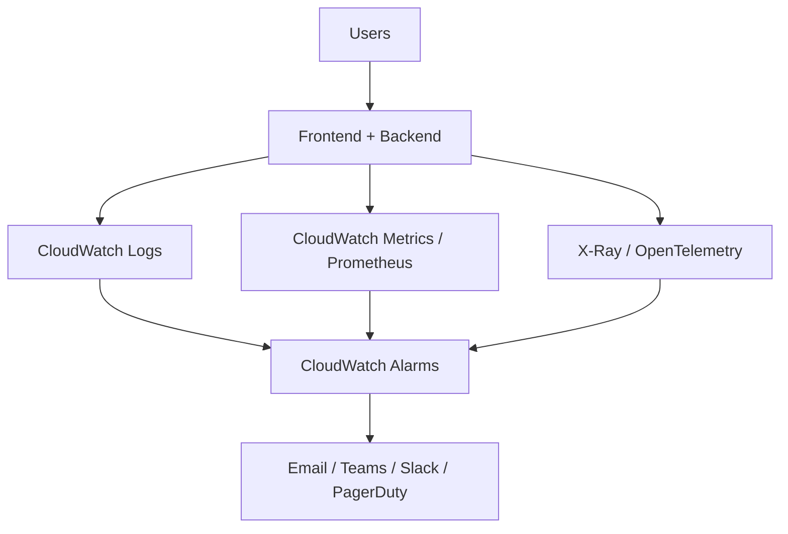
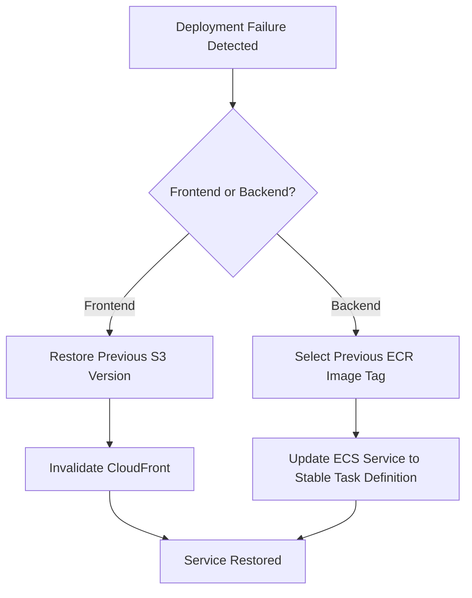

# AWS Architecture Diagram + Deployment Flow Document

## 1. Document Purpose

This document provides a **production-ready AWS architecture diagram** and a **complete deployment flow** for an application built with:

- **Frontend:** Angular
- **Backend:** Java 17 + Spring Boot Microservices
- **Database:** MySQL
- **Cloud:** AWS
- **Container Platform:** ECS Fargate (recommended)

It is intended to help with:
- Solution design reviews
- Technical documentation
- Interview explanations
- Project planning
- Production deployment readiness

---

## 2. Recommended AWS Architecture Overview

### Key Services Used
- **Route 53** for DNS
- **CloudFront** for CDN
- **S3** for Angular frontend hosting
- **AWS WAF** for web application protection
- **API Gateway** (optional external API facade)
- **Application Load Balancer (ALB)** for routing
- **Amazon ECS Fargate** for Spring Boot microservices
- **Amazon ECR** for Docker images
- **Amazon RDS MySQL** for relational data
- **Amazon ElastiCache Redis** for caching
- **Amazon MSK / SQS / SNS** for asynchronous communication
- **CloudWatch + X-Ray** for monitoring and tracing
- **Secrets Manager** for secrets
- **IAM / Security Groups / ACM / KMS** for security

---

## 3. High-Level AWS Architecture Diagram

> This Mermaid diagram can be rendered in GitHub, Markdown viewers that support Mermaid, or documentation tools like Azure DevOps Wiki / GitLab / Obsidian.



---

## 4. Layer-by-Layer Architecture Explanation

## 4.1 Edge Layer

### Route 53
Used for domain routing:
- `app.example.com` -> CloudFront
- `api.example.com` -> API Gateway / ALB

### CloudFront
Used to:
- Deliver Angular static assets globally
- Improve frontend performance
- Terminate HTTPS with ACM
- Reduce latency through edge caching

### WAF
Used for:
- OWASP rule protection
- IP rate limiting
- Bot filtering
- Threat mitigation for public endpoints

---

## 4.2 Frontend Layer

### S3 + CloudFront
The Angular application is built and deployed as static assets to S3.
CloudFront serves the content globally.

### Angular Runtime Flow
1. User loads the Angular app from CloudFront
2. Angular initializes configuration
3. Angular calls backend API via API Gateway or ALB
4. JWT token is attached using Angular HTTP interceptor

---

## 4.3 API Entry Layer

### API Gateway (Optional but Recommended for Public APIs)
Use API Gateway when you need:
- Centralized throttling
- API key / usage plans
- Request validation
- Better external API management
- Token authorizers and custom auth integrations

### ALB
Use ALB for path-based routing to ECS services.

Example routing:
- `/auth/*` -> Auth Service
- `/users/*` -> User Service
- `/catalog/*` -> Catalog Service
- `/orders/*` -> Order Service
- `/notifications/*` -> Notification Service

---

## 4.4 Compute Layer

### ECS Fargate
Each microservice is packaged as a Docker image and deployed independently as an ECS service.

Each service includes:
- Task definition
- CPU and memory allocation
- Auto scaling configuration
- CloudWatch log configuration
- Health checks

### Why ECS Fargate?
- No server maintenance
- Easy deployment model
- Native AWS integration
- Good fit for Spring Boot microservices

---

## 4.5 Data Layer

### Amazon RDS MySQL
Recommended for persistent relational data.

Best practices:
- Multi-AZ enabled
- Automated backups
- Performance Insights
- Encryption at rest using KMS
- Read replicas for high read traffic

### ElastiCache Redis
Recommended for:
- Caching frequently accessed data
- Session/token state if required
- Rate limiting counters
- Short-lived verification / OTP use cases

### MSK / SQS / SNS
Recommended for async communication:
- Order events
- Notification workflows
- Audit messages
- Reporting triggers

---

## 5. Production Network Diagram



---

## 6. Request / Runtime Flow Diagram



---

## 7. CI/CD Deployment Flow Diagram

```mermaid
flowchart LR
    DEV[Developer Commit] --> GIT[GitHub / Azure Repos / Bitbucket]
    GIT --> CI[CI Pipeline - Jenkins / GitHub Actions]
    CI --> TEST[Run Unit Tests / Integration Tests / Lint / Sonar]
    TEST --> BUILD[Build Angular + Maven Package]
    BUILD --> IMG[Build Docker Images]
    IMG --> ECR[ECR Push Versioned Images]
    BUILD --> ART[Store Frontend Build Artifact]

    ECR --> CD[CD Pipeline]
    ART --> CD
    CD --> DEVENV[Deploy to Dev]
    DEVENV --> QA[Deploy to QA / UAT]
    QA --> APPROVAL[Manual Approval for Production]
    APPROVAL --> PROD[Production Deployment]
    PROD --> SMOKE[Smoke Tests / Health Checks]
    SMOKE --> MON[Monitoring and Alerts]
```



---

## 8. Frontend Deployment Flow

### Angular Deployment Steps
1. Developer commits frontend code
2. CI pipeline installs dependencies
3. Run lint and unit tests
4. Build Angular for production:

```bash
ng build --configuration=production
```

5. Upload `dist/` files to S3 bucket
6. Invalidate CloudFront cache
7. Run smoke test for UI availability

### Frontend Deployment Diagram



---

## 9. Backend Deployment Flow

### Spring Boot Microservice Deployment Steps
1. Developer commits backend code
2. CI pipeline runs Maven build and tests
3. JAR is packaged
4. Docker image is built
5. Image is tagged with version
6. Image is pushed to ECR
7. ECS service is updated with new task definition
8. ALB routes traffic to healthy new tasks
9. Old tasks are drained and removed

### Backend Deployment Diagram



---

## 10. End-to-End Production Deployment Flow

### End-to-End Sequence



---

## 11. Recommended Deployment Strategies

## 11.1 Rolling Deployment
Suitable for most standard releases.

**Flow:**
- Start new ECS tasks
- Wait for health check success
- Gradually stop old tasks

**Pros:**
- Simple
- Low maintenance

**Cons:**
- Small risk during partial rollout

---

## 11.2 Blue-Green Deployment
Recommended for production-critical applications.

**Flow:**
- Deploy new version in parallel environment
- Run smoke / validation tests
- Shift traffic from Blue to Green
- Rollback quickly if required

**Pros:**
- Fast rollback
- Safer release process

**Cons:**
- Higher cost during deployment window

---

## 11.3 Canary Deployment
Recommended for high-risk changes.

**Flow:**
- Route small percentage of traffic to new version
- Monitor metrics and error rate
- Gradually increase traffic if stable

**Pros:**
- Safest for critical changes
- Real production validation

**Cons:**
- More operational complexity

---

## 12. ECS Deployment Model

Each microservice in ECS should have:
- ECS cluster
- Task definition
- ECS service
- Auto scaling policy
- Target group
- ALB listener rule
- CloudWatch log group
- IAM task execution role
- IAM task role

### Example Mapping
- `auth-service` -> target group `tg-auth`
- `user-service` -> target group `tg-user`
- `catalog-service` -> target group `tg-catalog`
- `order-service` -> target group `tg-order`
- `notification-service` -> internal event consumer service

---

## 13. Environment Promotion Flow



### Best Practice
- Build once
- Promote the same Docker image across all environments
- Change only environment-specific configurations

---

## 14. Infrastructure as Code Recommendation

Use **Terraform** or **CloudFormation** for:
- VPC
- Subnets
- ALB
- ECS cluster and services
- RDS
- Redis
- ECR
- IAM roles
- Security groups
- Route 53
- CloudFront
- WAF
- Secrets Manager

### Suggested Terraform Modules
- `networking/`
- `security/`
- `frontend/`
- `ecs-cluster/`
- `ecs-services/`
- `rds/`
- `redis/`
- `messaging/`
- `monitoring/`

---

## 15. Operational Monitoring Flow



---

## 16. Rollback Flow

### Frontend Rollback
- Restore previous S3 artifact version
- Re-invalidate CloudFront cache

### Backend Rollback
- Redeploy previous stable Docker image tag from ECR
- Update ECS service to last known good revision

### Rollback Diagram



---

## 17. Production Readiness Checklist

### Frontend
- [ ] Angular production build optimized
- [ ] S3 bucket private
- [ ] CloudFront configured with HTTPS only
- [ ] Cache invalidation strategy defined
- [ ] Error pages configured

### Backend
- [ ] All services containerized
- [ ] Health checks implemented
- [ ] Readiness/liveness endpoints configured
- [ ] Resource requests and limits tuned
- [ ] Auto scaling enabled
- [ ] Secure secrets retrieval configured

### Data
- [ ] RDS Multi-AZ enabled
- [ ] Backups configured
- [ ] Performance Insights enabled
- [ ] Redis replication configured
- [ ] Migration strategy defined

### Security
- [ ] WAF enabled
- [ ] IAM least privilege applied
- [ ] TLS enforced
- [ ] Security groups restricted
- [ ] Secrets Manager used
- [ ] JWT expiration and refresh flow implemented

### Operations
- [ ] CloudWatch alarms configured
- [ ] Deployment rollback plan tested
- [ ] DR and backup restore tested
- [ ] CI/CD approval gates configured

---

## 18. Interview-Friendly Explanation

> The Angular frontend is hosted in S3 and delivered globally through CloudFront. Public traffic is protected using WAF and optionally routed through API Gateway. API requests are sent to an Application Load Balancer, which performs path-based routing to Spring Boot microservices running on ECS Fargate in private subnets. Persistent data is stored in Amazon RDS MySQL, Redis is used for caching, and asynchronous workflows are handled via MSK or SQS. The complete deployment is automated through CI/CD, using ECR for Docker images, CloudWatch for monitoring, and Secrets Manager for secure configuration management.

---

## 19. Suggested Next Deliverables

The next useful files you may want are:

1. **Terraform starter structure**
2. **ECS task definition samples**
3. **GitHub Actions or Jenkins pipeline YAML**
4. **AWS security design document**
5. **Microservices low-level design (LLD)**
6. **Detailed database-per-service architecture note**
7. **Production go-live checklist**

---

## 20. Quick Copy-Paste Architecture Summary

```text
Users -> Route53 -> CloudFront -> S3 (Angular)
                         |
                         -> WAF -> API Gateway -> ALB
                                              |
                                              -> ECS Fargate Spring Boot Microservices
                                                     |
                                                     -> RDS MySQL
                                                     -> ElastiCache Redis
                                                     -> MSK / SQS

Cross-cutting:
- ECR
- CloudWatch
- X-Ray
- Secrets Manager
- IAM
- ACM
- WAF
```

---

**Document Version:** 1.0  
**Prepared By:** M365 Copilot  
**File Type:** Markdown with Mermaid diagrams  
**Usage:** Download and open in any Markdown editor. For best results, use a Markdown viewer that supports Mermaid.
